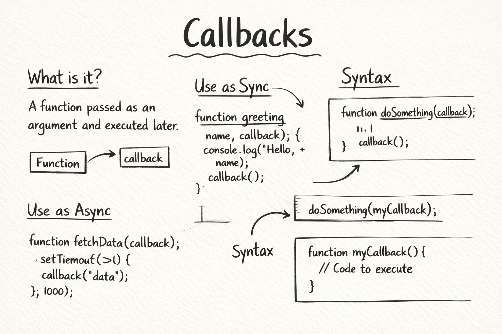

# Callbacks in JavaScript: Why They Exist [Live](https://dev.to/anoop-rajoriya/callbacks-in-javascript-why-they-exist-1mi7)

## Content List
 - [What is a callback function](#what-is-a-callback-function)
 - [Why callbacks are used in asynchronous programming](#why-callbacks-are-used-in-asynchronous-programming)
 - [Passing functions as arguments](#passing-functions-as-arguments)
 - [Callback usage in common scenarios](#callback-usage-in-common-scenarios)
 - [Basic problem of callback nesting]()

## What is a callback function

A callback is a function which is passed as an argument to another function, which than "called back" to that within the outer function to complete the action. There are main two types of callback function synchronous and asynchronous:

- **Synchronous Callback:** this function are immediatly run after a outer function called, without waiting for a asynchronous operation, like `map()` or `foreach()`

```js
const users = ["anoop", "pankaj", "rohit"]

function callback (elm){
    console.log(elm)
}

console.log("Start")
user.foreach(callback) // run immediatly
console.log("End")
```

- **Asynchronous Callback:** these function are executed after a asyncronous operation has finished like timers or network call. These ensure application doesn't freez waiting for data, like `setTimeout()`, and `fetch()`.

```js
function callback (){
    console.log("Async task completed")
}

console.log("Start")
setTimeout(callback, 1000)
console.log("End")
```

## Why callbacks are used in asynchronous programming

We know Javascript is a single-threaded languages means it run all task on sigle main thread one-by-one. Without any acynchronous technique, long running task can block the entire programm which cause browser or server freeze untile the task finished.

There are some reasons why asynchronous programming essential:

1. **Preventing UI Blocking:** in broswer both js exection and ui updates handles by main thread if long running operation executed synchronously it blocked the browser ui.

2. **Handle Hight Latency Operation:** may operation like network request, file i/o, times and db queries are inherantly slow or unpredictable.

3. **Improving Performance & Throughtput:** server side environments like Node.js, aschrony allow a single server to handle thousands of concurrent connection, instead of waiting one request.

4. **Non-blocking Execution:** asynchronouse code allows the engines to **hands-off** the task to the environment, while it handle task in background. Event loop allow main thread to continously execute other code when the backround task is done it sent back to the main thread to be processed.

## Passing functions as arguments

Passing functions as arguments need to passing a function references wihtout paranthesis not call or can pass anonymous function no need references holding. passing function executed it inplace and pass its returned valued instead.

```js
const greet = (name)=>{ // greet holds function referenc
    console.log(`Hello ${name}`)
}

function processUserInput(callback){
    const name = "Ramu"
    callback(name)
}

console.log("Start")
processUserInput(greet) // passing reference not call
console.log("End")
```

## Callback usage in common scenarios

There are some common scenarios where callbacks are essentials:

1. **Aynchronous Events and Timers:** callbacks are used for tasks which takes unknowen amount of time, instead stoping exection js scheduled a callback which run on task completion.

2. **Events Handling in Browsers:** web pages ui relay on the callbacks which responds on user interation. We register a callback for specific event which sits ideal until a specific event trigger.

3. **Functional Array Manipulation:** for working with arrays js provide a higer order functions for which require a rules provided as callback to process each item.

4. **Node.js & File Operation:** in the server side callbacks are the core part of the non-blocking i/o model.

5. **Custom Reusable Logic:** developers use callbacks to make function logic more flexible which allow caller to inject their own behaviour.