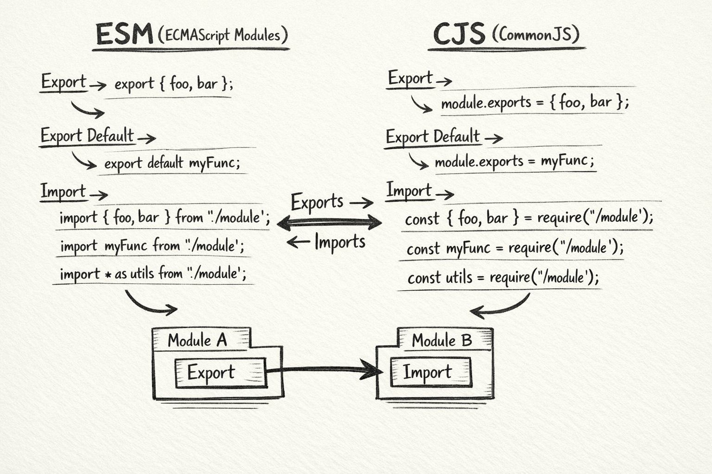

# JavaScript Modules: Import and Export Explained [Live](https://dev.to/anoop-rajoriya/javascript-modules-import-and-export-explained-4bim)

## Content List
- [What are need of modules](#what-are-the-need-of-modules)
- [How function and values exporting](#how-function-and-values-exporting)
- [How to importe moduels](#how-to-import-moduels)
- [Difference between default vs named exports](#difference-between-default-vs-named-exports)
- [Benefits of modular code](#benefits-of-modular-code)

## What are the need of modules

In javascript, modules are needed for transformation large, complex, scripts into manageable and efficient software system. In any application when it grow form inital basic script to fully scalable platform the need of formal way to organize and share become critical.

- **Eliminating NameSpace Polution:** in early all functions and variables lived in Global Scope if there are variables declared with same name they override eachother known as Namespace Polution. Moduels solve it because they have module scope, variables and funciton only accessecible inside it unless it explicitly exported.

- **Explicit Dependency Managment:** without modules developers need to manage scripts loading order to ensure if any script relied on a library it must be loade above it. If using modules the runtimes like node.js or modern browsers automatically resolve it.

- **Code Reusabiltiy & Maintainability:** moduels allow us to write any logic once and reuse it acrose multiple places. Allow to split code into small pieces to focus each concern make easy to understand and debug.

- **Performance Optimization:** modern modules system enables several performance boosting techniques like Tree Shaking (tools like webpack analyze code and remove dead code resulting minimal production file size) and Lazy loading (dynamic importing, import specific code on certain user actions rather than just donwloading entire code once)

- **Singleton Behaviour:** means if multiple files importing save module, they all recieve a reference of same instance. It helpful in managing applicaiton states, and sharing services like logger or db connections.

## How function and values exporting

There are two pirmary way of exporting, ES Modules (ESM) a modern standared used in browsers and new node.js projects and CommonjS (CJS) it is a traditional system used in node.js

### 1. ESM (Modern Standard)

ES modules used `export` keyword to export functions and variables 
this used in tow main ways:

**1. Named Export:** exporting multiple function and values from a single file, you must import them using the excat same name.

```js
// Inline export
export const myValue = "some thing"
export function myFunc (){}

// Grouped export
export {myValue, myFunc}

// Renaming export
export {myFunc as newName}
```

**2. Default Export:** exporting only one primary value per module, you can import a default export using any name you choose.

```js
export default function sayHi () {}
// OR
export default "hello world"
```

**3. Re-Exporting:** you can **relay** exports from another file without importing them first. Often used in **barrel files** to organize code.

```js
export {name} from "./module.js"
```

### 2. CJS (Lagacy System)

Common js is the system used by default of older node.js versions and is still widely used for many server side packages. It used `moduel.exports` object.

**1. Single Export:** export a single vlaue by replacing entire exports object form a module.

```js
module.exports = function() {}
```

**2. Multiple Exports:** exporting multipel values by adding properties to the exports object.

```js
module.exports.myFunc = ()=>{}
// OR
exports.myValue = "hello world"
```

**3. Object Literals:** this is a common pattern to exports multiple values at onece.

```js
module.exports = {funcOne, valOne, funcTwo, valTwo}
```

## How to import moduels

### 1. ESM (Modern Standard)

In EM mudules importing fuctions and values we need to use `import` keyword for using it you need to change Node.js default system from common to ES modules by adding `type:module` in package.json file. or if using in html use `type="moduel"` in src tag. There are multipel ways to use import:

**1. Named Import:** it used to import specific items form module. The name muste be matching to names used in the export statment.

```js
import {add, subtract} from "./math.js"
```

**2. Default Import:** used when a module has a `export default` you can name it whatever you like.

```js
import myFunc from "./myModule.js"
```

**3. Namespace Import:** used to import all exported items into a single object.

```js
import * as MathUtils from "./math.js"
```

**4. Renaming (Aliasing):** if there are name conflicts, you can rename in import using `as` keyword.

```js
import {conflictName as customName} from "./utils.js"
```

**5. Dynamic Import:** used to loade modules on demands (lazy loading) via function-like call which return a promise.

```js
const module = await import("./largeFile.js")
```

### 2. CJS (Lagacy System)

If you are working with older Node.js version or a project not configured with ES moduel than you can use `require()`

**1. Import Whole Module:** passing module name with path in `require()` which return a all items exported from it.

```js
const fs = require("fs")
```

**2. Destructing with require():** you can use destructuring to extract all properties form exports object.

```js
const {readFile, writeFile} = require("fs")
```

## Difference between default vs named exports

Using both default and named exports help to achieve same goals but they are differ signaficantly to eachother in quantity, naming flexibility and syntax.

**Key Differences:***

1. **Exporting Quantity:** default export allow single export of item from a moduel at the other hand named export used to export multipel items from a same module.

2. **Naming:** default exported items can be import with any name but named exported only import with name which used in export.

3. **Import Syntax:** named exported required curly braces if not used in inline but default export not need any thing like that.

4. **Renaming (Aliasing):** used `as` keyword to rename named exported items and default exported not need it can name it directly.

## Benefits of modular code

It have many benefits but there are some primary benefits of modular code:

- **Encapsulation & Scope Protection:** moduels are creates their own private scope which preventing values and function leaking from into the global namespace.

- **Enhanced Reusability:** code written in modules can be imported or reused into differenct part of the entire application or across different part of the projects. It adheres DRY (don't repeat youself) principle and reduce redundant development.

- **Improved Maintainability:** since each module is responsible for a specific piece of functionality, locatin and fixing bugs is much simple. Developers can fix or update code without risk of breaking the unreleased part of system.

- **Better Dependency Management:** module system like ES6 modules allow developers to explicitly declare dependencies using `import` and `export` keywords, which make it clear which file is rely on other.